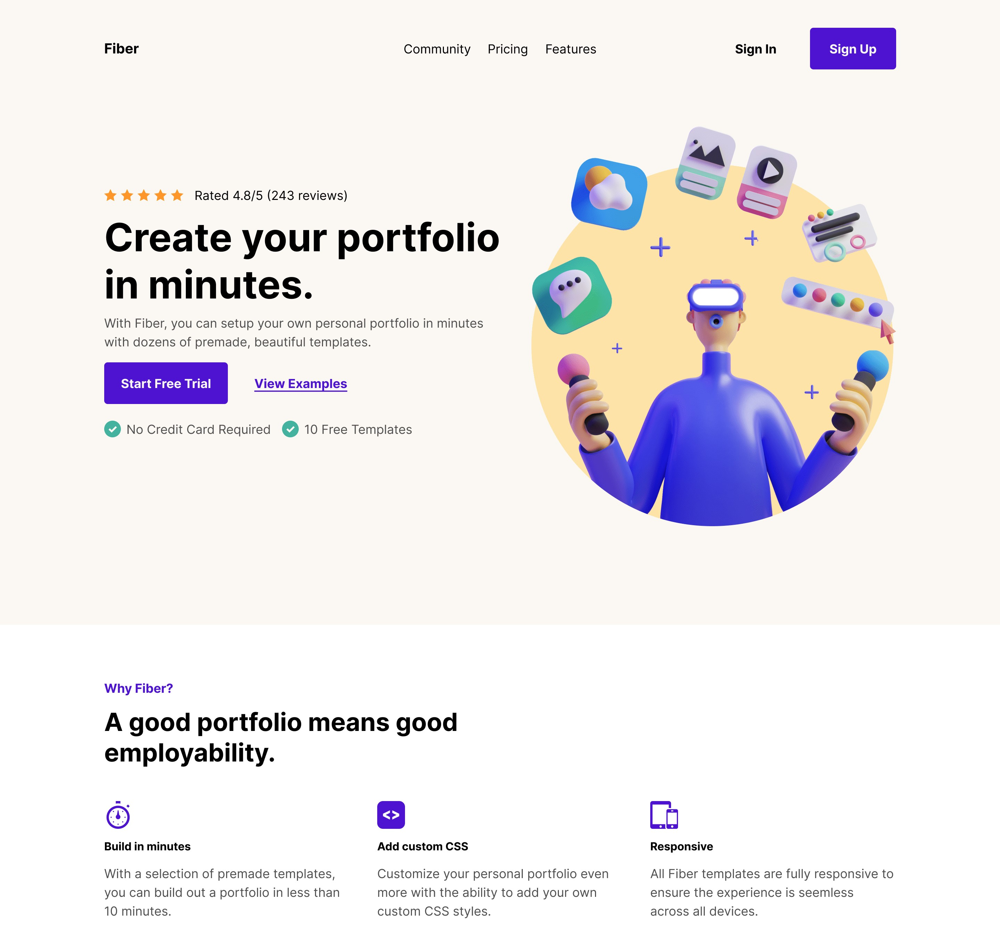

# Designo Agency website

React Practice website.

## Table of contents

- [Overview](#overview)
  - [Links](#links)
- [My process](#my-process)
  - [Built with](#built-with)
  - [Continued development](#continued-development)
- [Author](#author)

## Overview

### Links

- Solution: 
- Live Site: 

## My process

### Built with

- Semantic HTML5 markup
- CSS custom properties
- Flexbox
- CSS Grid
- Mobile-first workflow
- React.js

### Fonts Used

https://fonts.google.com/specimen/Inter

### Continued development

Now I am planning on learning more React and start applying it in my projects as well. 😃

## Author

- [Chaman Bravo](https://http://chamanbudhathoki.com.np/)

